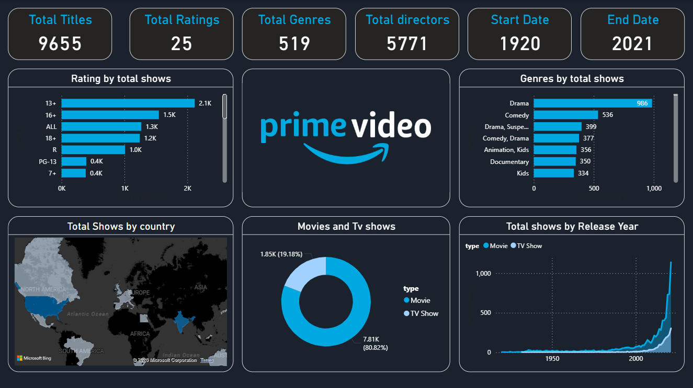

  

<h1 align="center">Amazon Prime Video Dashboard | Power BI</h1>

---

# About the Project

This project focuses on analyzing Amazon Prime TV Shows and Movies data using an interactive Power BI dashboard. The dashboard provides insights into content distribution, ratings, genres, release trends, and overall platform statistics.

The goal of this project is to perform Exploratory Data Analysis (EDA) and generate meaningful business insights from Amazon Prime content data using Power BI visualizations.

---

# Project Objectives

- Analyze Amazon Prime content library
- Compare Movies vs TV Shows distribution
- Identify popular genres and ratings
- Analyze content release trends
- Study country-wise content distribution
- Generate business insights using visual analytics

---

# Dataset Information

The dataset contains information related to:

- Movies & TV Shows
- Genre
- Ratings
- Country
- Release Year
- Duration
- Directors & Cast

---

# Tools & Technologies Used

- Power BI
- Power Query
- DAX
- Data Cleaning
- Data Visualization

---

# Dashboard Features

- Movies vs TV Shows Analysis
- Genre Distribution
- Ratings Analysis
- Release Year Trends
- Country-wise Content Analysis
- Interactive Filters & Slicers

---

# Key Insights

- Identified dominant content types on Amazon Prime
- Analyzed most popular genres and ratings
- Studied yearly content release trends
- Generated streaming platform business insights

---

# Dashboard Preview

---

# Files Included

This repository contains 4 files:

1. AMAZON PRIME DASHBAORD TV & MOVIES.pbix → Power BI Dashboard File  
2. amazon_prime_dataset.csv → Dataset File  
3. Prime video logo.png → Amazon Prime Logo  
4. dashboard_image.png → Dashboard Screenshot  

---

# Skills Demonstrated

- Data Visualization
- Dashboard Development
- DAX
- Data Cleaning
- Business Analysis
- Power BI Reporting

---

# Author

Bhupendra Sethiya  
Aspiring Data Analyst | SQL | PostgreSQL | Power BI | Excel | Python
